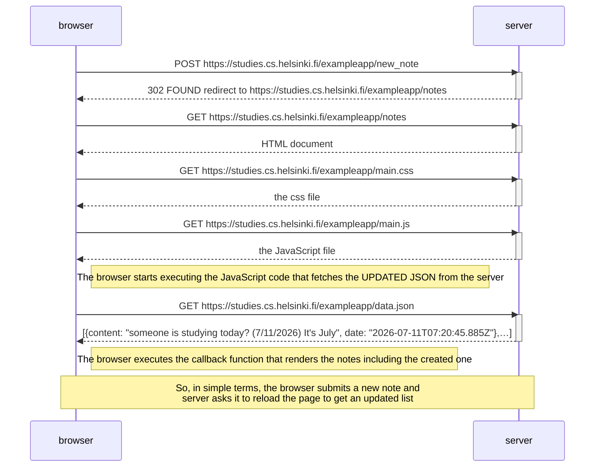

## New note diagram

```mermaid
sequenceDiagram
participant browser
participant server

    browser->>server: POST https://studies.cs.helsinki.fi/exampleapp/new_note
    activate server
    server-->>browser: 302 FOUND redirect to https://studies.cs.helsinki.fi/exampleapp/notes
    deactivate server

        browser->>server: GET https://studies.cs.helsinki.fi/exampleapp/notes
    activate server
    server-->>browser: HTML document
    deactivate server

    browser->>server: GET https://studies.cs.helsinki.fi/exampleapp/main.css
    activate server
    server-->>browser: the css file
    deactivate server

    browser->>server: GET https://studies.cs.helsinki.fi/exampleapp/main.js
    activate server
    server-->>browser: the JavaScript file
    deactivate server

    Note right of browser: The browser starts executing the JavaScript code that fetches the UPDATED JSON from the server

    browser->>server: GET https://studies.cs.helsinki.fi/exampleapp/data.json
    activate server
    server-->>browser: [{content: "someone is studying today? (7/11/2026) It's July", date: "2026-07-11T07:20:45.885Z"},…]
    deactivate server

    Note right of browser: The browser executes the callback function that renders the notes including the created one

    Note over browser,server: So, in simple terms, the browser submits a new note and<br/> server asks it to reload the page to get an updated list
```
